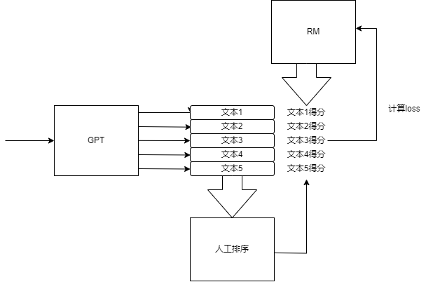

# 大模型训练架构
<a href="https://openai.com/index/chatgpt/" title="openai官网发布的技术架构">openai官网发布的技术架构</a>

<a href="https://www.nolibox.com/creator_articles/principle_of_ChatGPT.html" title="民间讲解">民间讲解</a>

<a href="https://blog.csdn.net/gzroy/article/details/132630418" title="奖励模型讲解">奖励模型讲解</a>
## 奖励模型
在做强化学习研究时，对于奖励函数的设置是一个玄学问题，总是浪费各种时间在调参上，于是在想能不能把奖励模型也用神经网络训练出来呢？
网上闲逛的时候看到了openai开发的chatgpt的算法架构中提到了RLHF的概念，然后仔细查看发现其中提到训练一个奖励模型。感觉很有意思所以仔细调研了一下。
### 奖励模型原理
其宗旨通过监督学习训练一个神经网络对GPT生成的文本进行评分，其类似于RL中的critic网络。但是其标签通过人类进行标记。

GPT生成多个回答，奖励模型对每个回答得出一个评分，人类对所有回答进行排序（因为人类对于回答的评分标准不同，但是排序通常能统一选出最优秀的回答）。通过计算每个回答之间的质量差值
$$
\log \left(\sigma\left(r_\theta\left(x, y_a\right)-r_\theta\left(x, y_b\right)\right)\right)
$$
其中表示对于问题$x$,回答$a$与回答$b$之间的评分差值。显然根据人类排序，这个差值应该是越大越准确，假设有k个回答，总的loss值为
$$
\operatorname{loss}(\theta)=-\frac{1}{\binom{k}{2}} E_{\left(x, y_a, y_b\right) \sim D}\left[\log \left(r_{\theta\left(x, y_a\right)}-r_{\theta\left(x, y_b\right)}\right)\right]
$$
对loss进行取反，那么神经网络的目标函数就是让这个loss最小化，让差值最大化。

